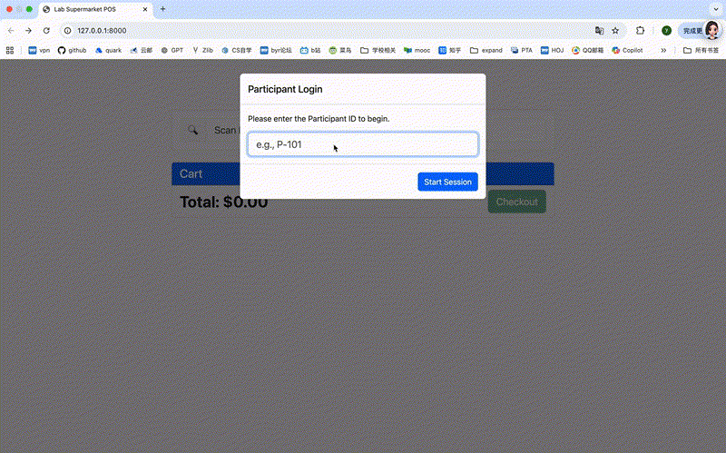
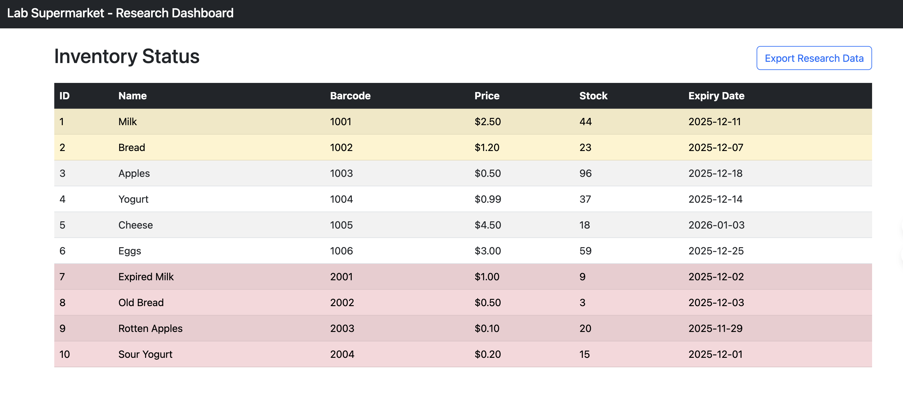

# Lab Supermarket POS & Research Data Platform 

> **Note:** This project was developed as a technical prototype specifically for the **Student Assistant (HiWi)** application at the **Institute for Food and Resource Economics (ILR), University of Bonn**.

## Project Overview
This is a full-stack **Point-of-Sale (POS) Simulation** designed to support consumer behavior research. Unlike standard commercial retail systems, this platform prioritizes **participant tracking** and **experimental data integrity**.

It addresses the core requirements of the Lab Supermarket facility:
1.  **Simulating Purchases:** A web-based interface to mimic the checkout process without physical hardware.
2.  **Research Data Collection:** Linking every transaction to a specific `Participant ID`.
3.  **Inventory Management:** Tracking stock levels and **expiry dates** to simulate waste scenarios.

---

## Demo & Screenshots

### 1. The POS Interface (Simulation)


*(Designed for efficiency: Large UI elements for touchscreens/kiosk mode)*

### 2. Admin Dashboard (Expiry Alerts)

*(Inventory logic highlights expired items in **RED** and items expiring soon in **YELLOW**)*

---

## Key Features (System Thinking)

I designed this system with **Experimental Control** in mind:

* ** Participant-First Logic:**
    The system enforces a "Login" modal before every session. Transactions cannot proceed without a valid `Participant ID`. This ensures sales data is always linkable to demographic data.

* ** Auto-Session Reset:**
    To prevent data contamination between test subjects, the system **automatically logs out** and resets the session immediately after a successful checkout, ready for the next participant.

* ** Smart Expiry Tracking:**
    The database tracks `expiry_date` for every product. The Admin Dashboard provides visual alerts for near-expiry stock, facilitating research on "Best Before Date" consumer behavior.

* ** Automated Data Pipeline:**
    Includes a one-click **CSV Export** feature using `Pandas`. It generates a flat-file dataset merging *Transactions*, *Participants*, and *Products*, ready for analysis in SPSS or R.

* ** Future-Ready Architecture:**
    Built with API endpoints ready to accept mock data from external hardware (e.g., cameras or eye-tracking sensors), facilitating future "Data Fusion" tasks.

---

##  Tech Stack

* **Backend:** Python 3.9+, **FastAPI** (High performance, easy API extension).
* **Database:** **SQLAlchemy** (ORM) + SQLite (Zero-configuration for MVP).
* **Frontend:** HTML5, **Bootstrap 5**, Vanilla JavaScript (Server-Side Rendering).
* **Data Analysis:** **Pandas** (For data structuring and export).

---

## How to Run

If you want to test the application locally:

1.  **Clone the repository**
    ```bash
    git clone [https://github.com/](https://github.com/)[YourUsername]/lab-supermarket-pos.git
    cd lab-supermarket-pos
    ```

2.  **Install Dependencies**
    ```bash
    pip install -r requirements.txt
    ```

3.  **Initialize the Database**
    (This script populates the DB with dummy research data, including expired items)
    ```bash
    python init_db.py
    ```

4.  **Start the Server**
    ```bash
    uvicorn main:app --reload
    ```

5.  **Access the System**
    * **POS Terminal:** [http://127.0.0.1:8000](http://127.0.0.1:8000)
    * **Admin Dashboard:** [http://127.0.0.1:8000/admin](http://127.0.0.1:8000/admin)

---

## Author
**[YUNYAN HE]**
Master’s student in Human-Centric Intelligent Systems (HCIS), RWTH Aachen University and the University of Bonn
